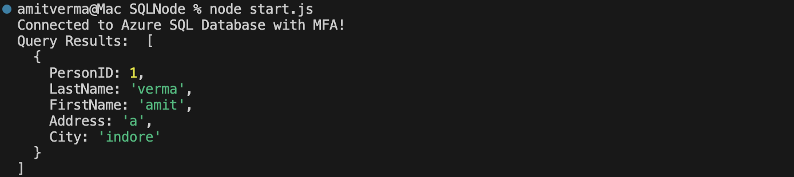

Readme 
---

# Azure SQL Connection with Node.js

This project demonstrates how to connect to Azure SQL Database using Node.js and fetch data from a specified table.

## Steps to Set Up:

1. **Create `start.js`**  
   The connection string for Azure SQL is retrieved from the Azure SQL portal and added to this file.

2. **Authentication with Azure**  
   For Multi-Factor Authentication (MFA), you need to log in to your Azure account via PowerShell.  
   Use the following command:
   ```bash
   az login
   ```
   Select your subscription once logged in.

3. **Run the Project**  
   Start the project by running:
   ```bash
   node start.js
   ```

4. **Fetch Results**  
   Upon running the script, the data from the SQL table will be fetched based on the defined query.



---
This README format clarifies the setup process and gives users a better understanding of the workflow. Let me know if you'd like further changes!


